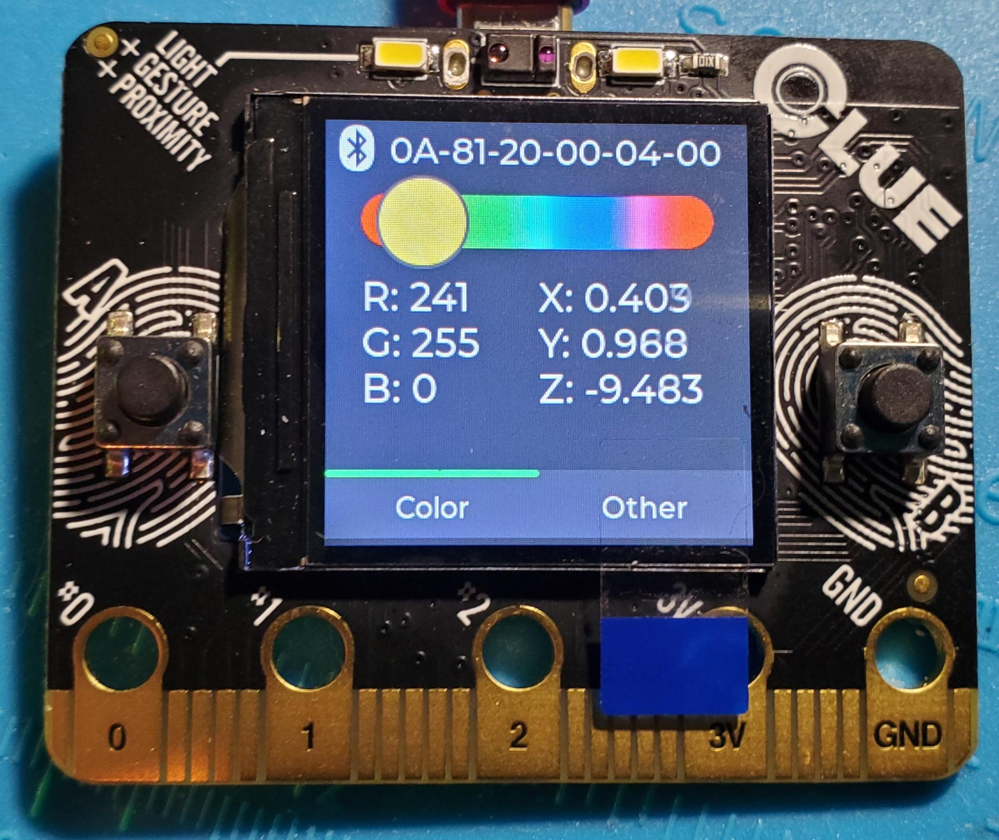

# NeoCLUE 
### Sensor-reactive wireless LED strip controller using Adafruit CLUE/ItsyBitsy (nRF52840)

## Contents
Two separate Arduino sketches are included in this project's [sketchbook](sketchbook):
- [__Controller__](sketchbook/Controller): Implemented for __Adafruit CLUE (nRF52840)__. Acts as Bluetooth (LE) central. Presents a GUI interface on its LCD for wirelessly controlling the LED strip attached to the __Driver__. Provides various modes to interact with the LED strip's appearance using the CLUE's embedded sensors.
- [__Driver__](sketchbook/Driver): Implemented for __Adafruit ItsyBitsy (nRF52840)__. Acts as Bluetooth (LE) peripheral. Drives an LED strip physically connected to it using commands and data received wirelessly from the __Controller__.

Care was taken to isolate the hardware board-specific details in both projects. So it shouldn't be *too* difficult to port either one to other devices.

The LCD graphics are implemented using the awesome [LVGL](https://lvgl.io) library ([Arduino port](https://github.com/lvgl/lv_arduino)). Configuration for the library is here: [extra/lv_conf.h](extra/lv_conf.h).

## Example

The initial proof-of-concept synchronizes the accelerometer on the __Controller__ (CLUE) with the RGB components of every Neopixel on a strip connected to the __Driver__ (ItsyBitsy). 

The GUI of the CLUE (below) shows the MAC address of the ItsyBitsy peripheral, the *real-time* mapping of each axis to its respective RGB component, and the resulting color being transmitted via Bluetooth LE GATT characteristic.

        <a href="https://youtu.be/4HHpXLRjPR0">
                 
                https://youtu.be/4HHpXLRjPR0 
        </a>

